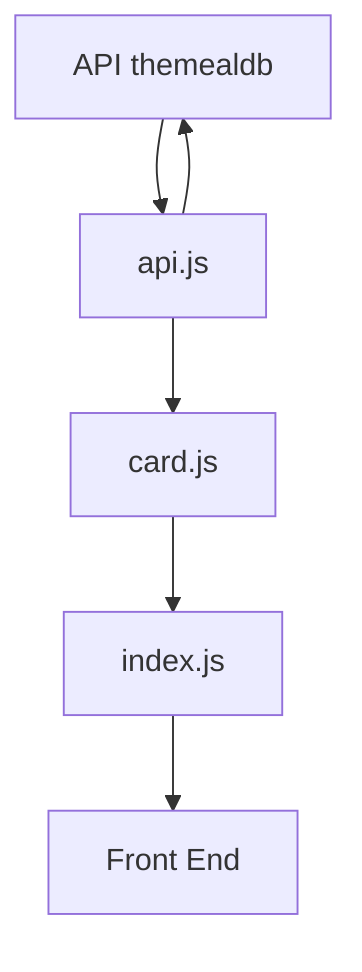

# Arquitectura-css
Curso de arquitectura de Alura. 

<a target="_blank" href="https://angeldiaz-21.github.io/Arquitectura-css/">Ver página</a>

[Ver prototipo](https://www.figma.com/file/ZIZuMVCGh6cE3UQvTbFsuj/alura-bootstrap?node-id=0%3A1) 

<!-- <pre>
    <a href="https://angeldiaz-21.github.io/front-santander-bedu-2022/">Ver página</a>
</pre> -->

## ¿Que se aprendió a lo largo del curso?
* Organizar y estructurar los archivos css del proyecto.
* Metodología de Diseño Atómico.
* Metodología BEM para nombrar clases CSS.
* Separación de responsabilidades al crear y mantener archivos más pequeños y no solo en uno solo.
* Hacer que un sitio web sea receptivo;
* Cómo configurar la adaptación del sitio a diferentes tamaños de pantalla.

Nota: A lo largo del curso fui agregando estilos en las secciones que creía que eran necesarias.

## Actualización del proyecto
Las actualizaciones que se agregarón fueron las siguientes:
* Se implemento el uso de un menú toggle.
  * Uso de `IntersectionObserver`.
* Se implementaron enlaces dentro de la misma página.
* Se hizo uso de la API [themealdb](https://www.themealdb.com/). 

### Menú toggle
En el caso del menú toggle se implemento ya que era necesario para dispositivos móviles o menores a 766px ya que visualmente, el diseño anterior no era el indicado. Así mismo al menu se le agregó la clase `sticky` que contiene las propiedades `position: fixed` y `top:0`, para que el menú siempre quede pegado en la parte superior a pesar de que se haga scroll hacia abajo.

* Al momento de dar click en el icono se activa el evento y se llama a la función `classToggle`, dentro de esta función se utiliza el `nav`, se le agrega la propiedad `classList` y el método `toggle`. Así que al dar click sobre el icono se puede remover o agregar la clase `menu-ToggleShow` y de esta forma se visualiza el menú o se quita.
* También se agregó un `addEventListener` con el fin que al seleccionar una opción del menú, o sea, al dar clic este se cierre. Esto solo sucede cuando aparece el menú toggle.
* También se utilizó `IntersectionObserver`, que permite "detectar" en que sección de la página estamos, con esto podemos añadir o quitar estilos. Por ejemplo, esta función me permite detectar en que sección de la página me encuentro, en un principio el menu tiene un color blanco y los elementos `a` no tienen una clase especial, pero si se hace scroll a la section recetas, entonces el menu cambia de color y el elemento `a`(Recetas) se le aplica un estilo(que aparezca subrayada y que tenga una sombra) y así mismo sucede con las otras secciones.
    
  * En este caso primero se necesita obtener todas las sections de la página así que se utiliza un `foreach` y una vez obtenido cada section se le envia como parámetro a la función `observer`, especificamente al método `observer`.
    ```
    sections.forEach(section => {
        observer.observe(section);
    });
    ```
    En la función `observer` se recibe las sections como `entries` y nuevamenete se recorren. Y se hace uso de un `if` y del método `isIntersecting` que nos permitirá detectar que la secciones se encuentre en la intersección señalada. Las intersecciones señaladas se encuentra en la constante `options`.

    La propiedad root especifica que elemento deberá emplear el observer para comprobar la intersección. En el caso de que no lo especifiquemos se tomará por defecto el viewport del navegador.  

    La propiedad rootMargin especifica el margen alrededor del elemento root de modo que podamos alargar o estrechar los lados del elemento root a la hora de realizar la comprobación.  
    
    Finalmente la propiedad threshold especifica en qué porcentaje de la visibilidad del elemento observado se debe ejecutar el callback . Por ejemplo, si queremos detectar cuando se ha traspasado el 50% especificaremos un threshold con valor 0.5 . En nuestro caso, el valor 1.0 indica que el umbral no se considera traspasado hasta que todos los píxeles del elemento sean visibles.

    Luego se hace uso de otro `if`, en donde si la section, su id es diferente de `banner` al menú se le agrega la clase `active` y si es falso se remueve la clase.
    Para asignarle el subrayado y la sombra a las opciones del menu cada que se cambie de section se llama a la constante `navList(nav > ul > li)` y se recorre todos sus elementos, primeramente se quita la clase `active`, luego se crea una nueva constante llamada `enlace` que contiene al nodo hijo de li, que sería a la etiqueta `<a></a>` y de la misma forma se quita la clase `active`. Por último, se encuentra un `if` que compara el id de la section que se encuentra dentro de la intersección y los compara con los dataset puestos en el `index.html(dentro del header->nav->ul>li)`. De esta forma si son iguales se agrega la clase active y si no se borran.

### Enlaces dentro de la misma página
El incluir enlaces dentro de la misma páginia nos ayuda en la navegación dentro de ella. Por ejemplo, si al usuario le interesa ver la información de la sección "Recetas" o "¿Quienes somos?", al dar un click puede acceder a esa sección de forma rápida.
Para esto se debe de poner marcadores a lo largo de la página (lugares a los que se quiere acceder o saltar con los enlaces) y poner enlaces que salten a los marcadores.
Por ejemplo, para acceder a la sección de recetas, en el menú, se agregaría el siguiente código:
```
<li data-nav="Recetas" class="menu-link">
    <a href="#Recetas" class="header__a--fuente">
        Recetas
    </a>
</li>
```

Y en la etiqueta `<section></section>` se agregaría el id:
```
<section class"recetas" id="Recetas"> </section>
```
### Uso de la API themealdb



Se hizo uso de esta API ya que se adapta a este proyecto y de esta forma se vuelve una página web más dinámica así como me permite mostrar mis habilidades. Ahora se puede hacer busquedas de recetas por nombre o de forma aleatoria y nos devuelve la información completa, tal como:
 * Nombre de la receta.
 * Imagen de la receta.
 * Intrucciones de la receta.
 * Video de la receta.
 * Ingredientes de la receta.

Se utilizaron funciones asíncronas (Async/await) y las peticiones HHTP se hicieron con `fetch`. 
Para obtener las recetas por nombre se utilizo el siguiente código:
```
const getRecipesByName = async (search) => {
    try {
        const resp = await fetch(`https://www.themealdb.com/api/json/v1/1/search.php?s=${search}`);
        if(resp.ok){
            const {meals} = await resp.json();
            return meals;
        }else{
            throw Error(`Request rejected with status ${resp.status}`)
        }
    } catch (error) {
        console.error;
    }
}
```
En donde básicamente recibe la búsqueda a realizar y se hace uso del template literals para concatenar la url con la receta a buscar. Y si todo esta bien regresamos los datos que nos proporcione para que al momento de crear las cards mediante JavaScript también se envia al front la información correspondiente de la receta. De esta misma manera se realizó para obtener una receta aleatoria, por primera letra y por id.
Como se mencionó anteriormente, primero se hace la búsqueda y una vez obtenida se crean las cards con JavaScript y se les asigna la información correspondiente. Y en el caso que el usuario desee ver las instrucciones completas y los ingredientes de la receta puede presionar el botón "Ver receta" y entonces se desplegará un modal con la información y si en dado caso ocurriera un error se mostraría otro modal con el mensaje "Por favor de intentar más tarde".

### Vistas de la página
<pre>
    
</pre>